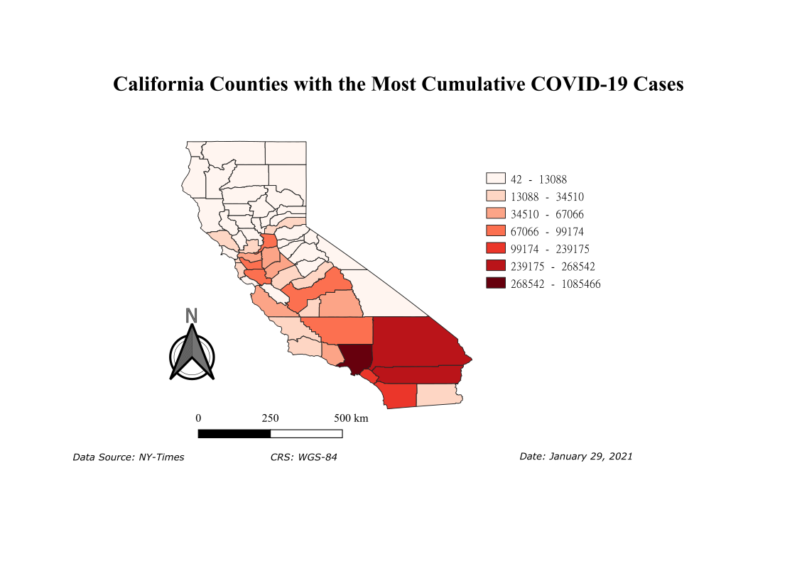
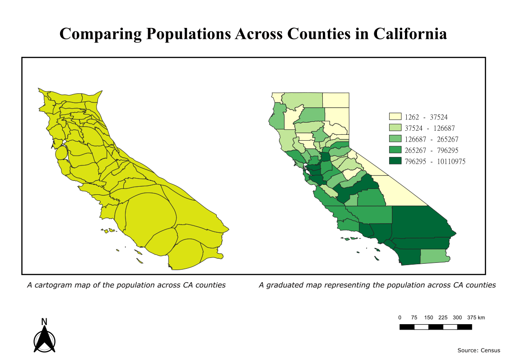
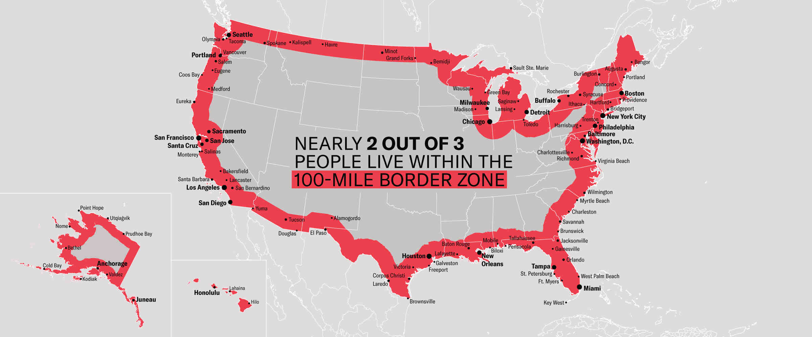
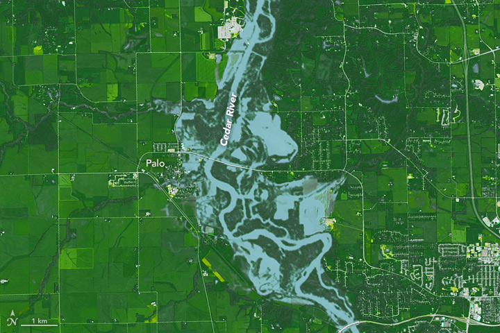
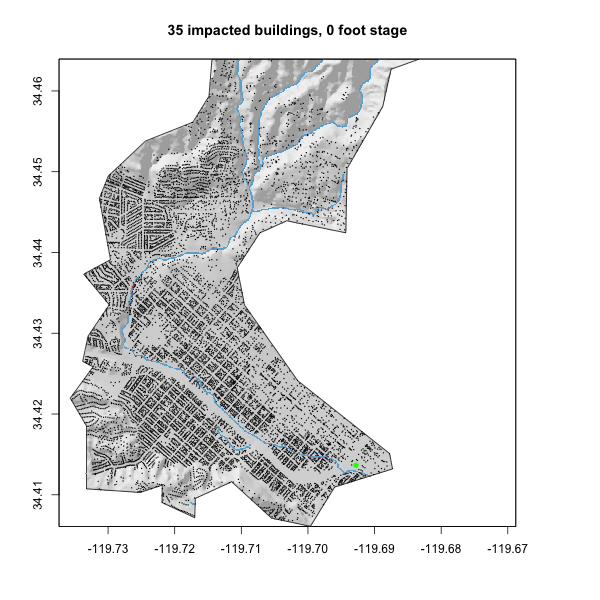
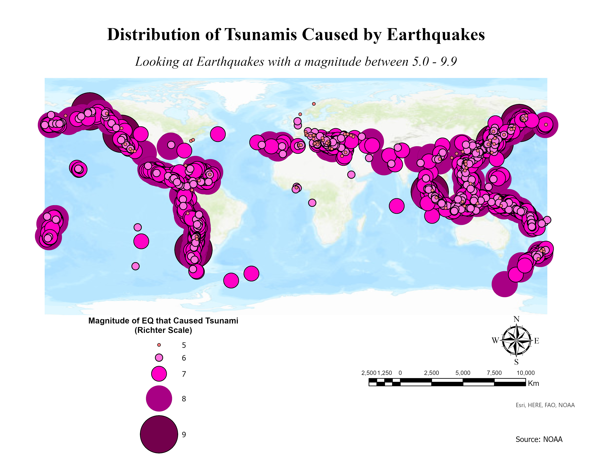

These projects were executed with the help of a variety of programs, including RStudio, ArcGIS, QGIS, Inkscape, GIMP, MATLAB, and GeoDa. Through these experiences, I gained valuable expertise in working with both vector and raster data.

The links below can be used to view the code and process used to create the outputs. 

## The Impact of COVID-19 in Wildfire Impacted Areas
- Understanding whether or not a change in the average of COVID-19 cases is related to the presence of a wildfire nearby. 
- Used anonymous GPS pings from mobile devices of an area to track population flow patterns utilizing Rstudio and ArcGis.

## Distribution of the Land Cover Change in Delhi, India
- Visualized the rate of change in land cover for Dehli. 
- Raster data was used in Rstudio. 

## Raster Analysis: Land Use in California
- Utilized raster data and satellite imagery to differentiate between various forms of land use in QGIS.

## Distribution of COVID-19 cases in CA 
- Vector data was collected from multiple sources and used in QGIS to create this map.

## Distribution of COVID-19 Deaths in CA
-Vector data was collected from multiple sources and used in QGIS to create this map.

## Distribution of CA Countie's Populations

## [Representing COVID-19 Data](https://jovanycota.github.io/GEOG-176A-lab/lab-02.html)
- Representing Real-Time COVID-19 data (at the time) using various different charts and graphs.
- Usng different sources of data in Rstudio to create outputs. 

## [Representing U.S. Cities and Distance](https://jovanycota.github.io/GEOG-176A-lab/lab-03.html)
- Visually representing U.S. cities based on population and distance to different borders.

## [Distribution of Dams in U.S.](https://jovanycota.github.io/GEOG-176A-lab/lab-04.html)
- Used different tessellations in order to highlight specific uses of Dams in the U.S. and differentiate between them in a map. 
- Vector data was used in Rstudio for the creation of the maps. 

## [Raster Analysis: Floods](https://jovanycota.github.io/GEOG-176A-lab/lab-05.html)
- Utilized raster data to study the impact of floods in an area.
- Rstudio was used for this analysis. 

## [Impact of Floods](https://jovanycota.github.io/GEOG-176A-lab/lab-06.html)
- Time lapse of the impact on buildings during a flood.
- Raster data was used in Rstudio to create this figure. 

## Distribution of Tsunamis Caused by Earthquakes
- Historical data of locations of Tsunamis was used to create this map.
- Map was created using QGIS. 

<i class="fas fa-rocket fa-8x"></i> 

