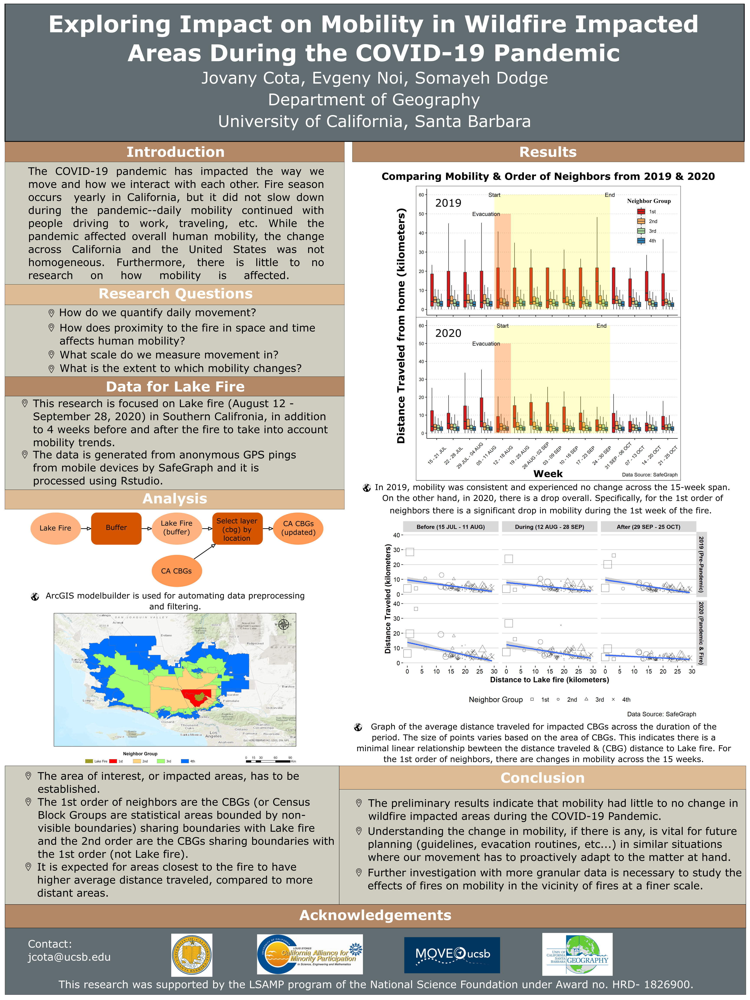
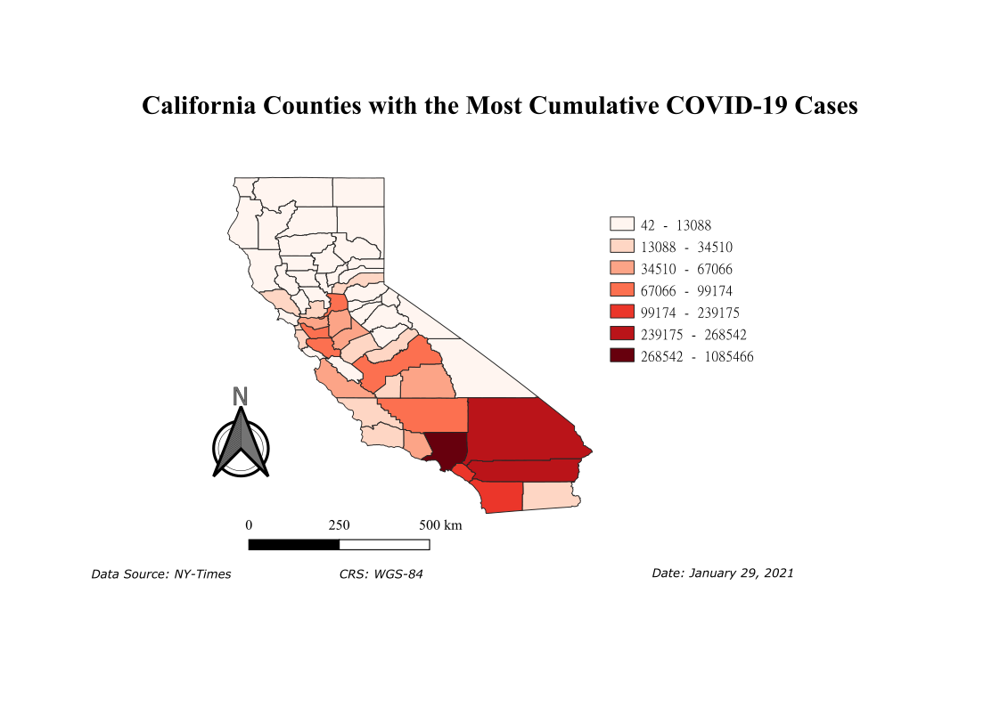
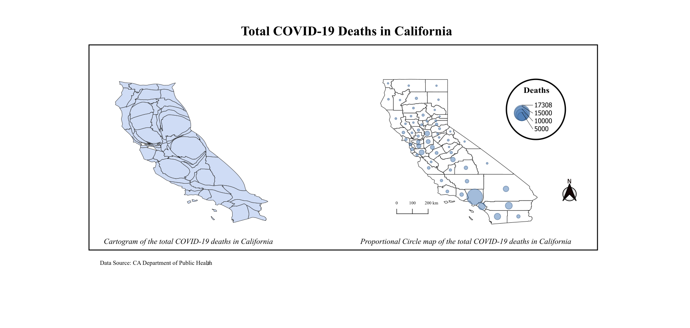
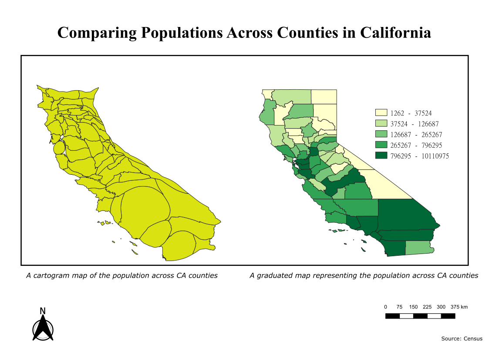
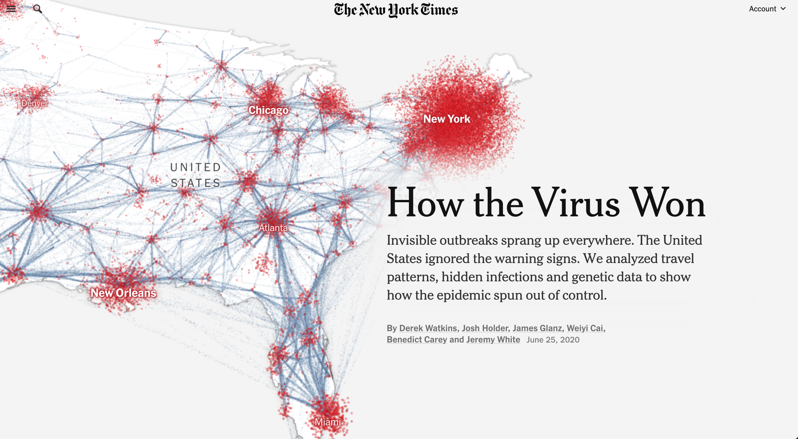
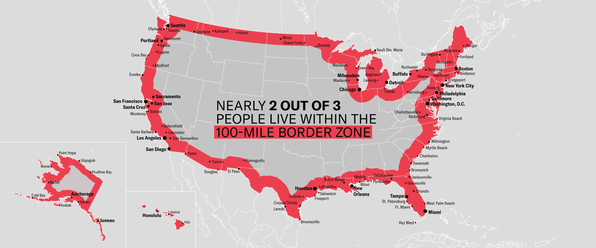
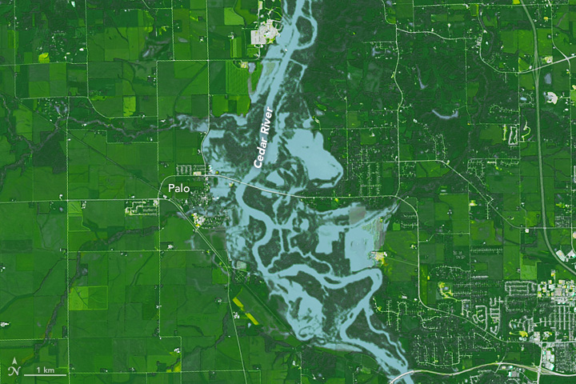
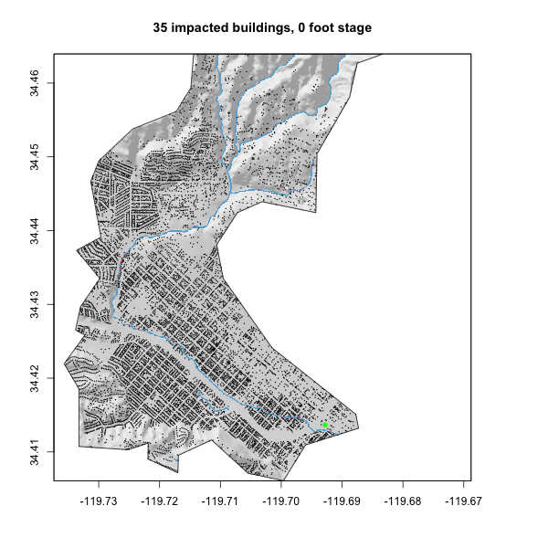
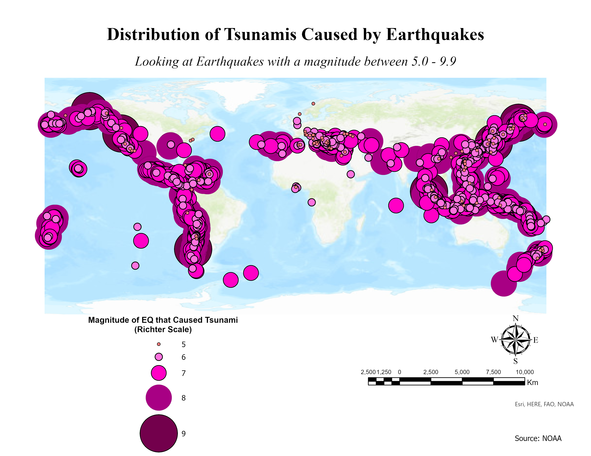

# **<u>GIS Projects</u>**

These projects were executed with the utilization of a variety of programs, including: RStudio, ArcGIS, QGIS, Inkscape, GIMP, MATLAB, and GeoDa. 

The links below can be used to view the code and process used to create the outputs. 

## **The Impact of COVID-19 in Wildfire Impacted Areas**

## **Distribution of the Land Cover Change in Delhi, India**
*My role in this group project was conducting the raster analysis on the area of interest and creating the graphs.*

## **Raster Analysis: Land Use in California**
- Utilized raster data and satellite imagery to differentiate between various forms of land use in QGIS.

## **Distribution of COVID-19 cases in CA** 

## **Distribution of COVID-19 Deaths in CA**

## **Distribution of populations in California counties**

## [Representing COVID-19 Data](https://jovanycota.github.io/GEOG-176A-lab/lab-02.html)
- Representing COVID-19 data using various types of charts and graphs.

## [Representing U.S. Cities and Distance](https://jovanycota.github.io/GEOG-176A-lab/lab-03.html)
- Visually representing U.S. cities based on population and distance to different borders.

## [Distribution of Dams in U.S.](https://jovanycota.github.io/GEOG-176A-lab/lab-04.html)
- Using different tessellations in order to highlight specific uses of Dams in the U.S. and differentiate between them in a map. 

## [Raster Analysis: Floods](https://jovanycota.github.io/GEOG-176A-lab/lab-05.html)
- Utilizing raster data to study the impact of floods in an area.

## [Impact of Floods](https://jovanycota.github.io/GEOG-176A-lab/lab-06.html)
- Analyzing the flood risk in an area.

## **Historical Distribution of Tsunamis Caused by Earthquakes**

<i class="fas fa-rocket fa-8x"></i> 

