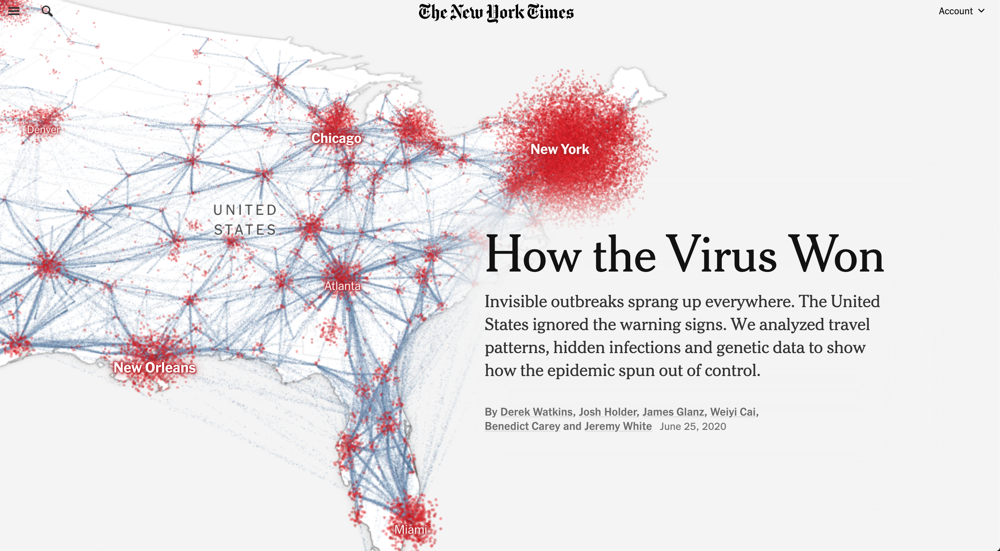

These projects were executed with the help of a variety of programs, including RStudio, ArcGIS, QGIS, Inkscape, GIMP, MATLAB, and GeoDa. Through these experiences, I gained valuable expertise in working with both vector and raster data.

The links below can be used to view the code and process used to create the outputs. 

## [Representing COVID-19 Data](https://jovanycota.github.io/GEOG-176A-lab/lab-02.html)
- This project allowed me to represent Real-Time COVID-19 data (at the time) using various different charts and graphs.

## [Representing U.S. Cities and Distance](https://jovanycota.github.io/GEOG-176A-lab/lab-03.html)
- Visually representing U.S. cities based on population and distance to different borders.

## [Distribution of Dams in U.S.](https://jovanycota.github.io/GEOG-176A-lab/lab-04.html)
- Using different tessellations in order to highlight specific uses of Dams in the U.S. and differentiate between them in a map. 
- Vector data was used in Rstudio for the creation of the maps. 

## [Raster Analysis: Floods](https://jovanycota.github.io/GEOG-176A-lab/lab-05.html)
- Using raster data to study the impact of floods in an area.
- Rstudio was used for this analysis. 

## [Impact of Floods](https://jovanycota.github.io/GEOG-176A-lab/lab-06.html)
- Time lapse of the impact on buildings during a flood.
- Raster data was used in Rstudio to create this figure. 

## Distribution of Tsunamis Caused by Earthquakes
- Historical data of locations of Tsunamis was used to create this map.
- Map was created using QGIS. 

<i class="fas fa-rocket fa-8x"></i> 

