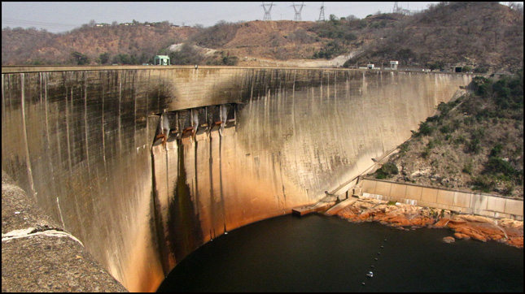

In the second-half of Summer 2020, I took an introductory course about GIS based in R. I wrote some code, and did some cool data science. Here is a collection of links! 

## [Building a project website](https://github.com/jovanycota?tab=repositories)

- I learned the importance of properly designating files in the correct repository. 
- I learned how to create my own website and how to personalize it.
- I learned how to upload an image in separate documents using coding.

## [Lab 2](https://jovanycota.github.io/GEOG-176A-lab/lab-02.html)
- I learned how to properly plot graphs using the ggplot function.
- I learned how to join two different data sets together using the left, right, inner, full, and semi join functions and the difference between each of them.
- I learned how to apply lag and rolling functions for feature-based time data.
- In this lab, I chose how to visually represent real-time COVID-19 data in different ways.

## [Lab 3](https://jovanycota.github.io/GEOG-176A-lab/lab-03.html)
- I learned how to turn objects into simple feature objects.
- I learned how to change an objects geographic coordinate system.
- I learned that all geometries are composed of point features.
- In this lab, I represented different sets of data within a certain range from a borderI 

## [Lab 4](https://jovanycota.github.io/GEOG-176A-lab/lab-04.html)
- I learned how to filter objects spatially.
- I learned how to properly use Unary (single) and Binary (multi) feature operations.
- I learned how to formulate functions for my own benefit.
- In this lab, I represented data in different tesselations in order to highlight a certain aspect of dams and differentiate between them

## [Lab 5](https://jovanycota.github.io/GEOG-176A-lab/lab-05.html)
- I learned how to crop and mask raster data.
- I learned how to use open street map and apply it to my coding.
- In this lab, I visually displayed the impacts of a flood on a specific area of interest.

## [Lab 6](https://jovanycota.github.io/GEOG-176A-lab/lab-06.html)
- I learned how to use slope, aspect, and hillshade functions.
- I learned how to use whitebox.
- In this lab, I applied everything I have learned throughout the course.

<i class="fas fa-rocket fa-8x"></i> 

