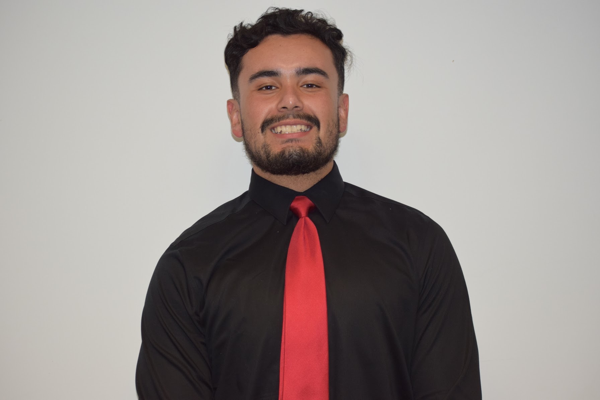

  

# Hi, I'm [Jovany Cota](https://github.com/jovanycota)!

  
I am a Third Year Geography Major (GIS emphasis) from Los Angeles, CA. My interests include: poverty, housing inequality, and education. My hobbies include: soccer, playing chess, and painting. 

Over the course of Summer 2020, I took a class on R. During that time, I became well-equipped on how to use R. For example, I can create plots, graphs, et.. from a specific set of data. Although my term with the class is over, I will continue to learn as much as I can on coding to improve my skills to the best of ability.

Currently, I am working with graduate students and Dr. Somayeh Dodge from the MOVE lab at UCSB, on a project dedicated to finding the effects of COVID-19 transmission and mobility in wildfire impacted areas. Last quarter (Fall 2020), I presented part of this research as a project funded by CAMP (CA Allegiance for Minority Participants) during their quarterly, research symposium. 

# Contact
  - Email: jcota@ucsb.edu
  - Phone: (323) 901-0442
  

